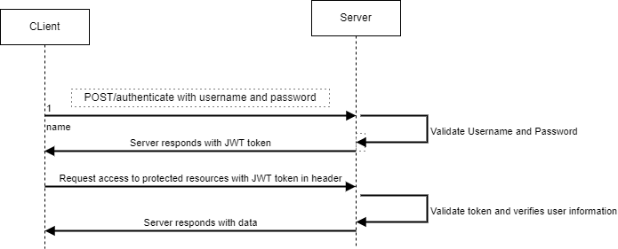

#About user management

user management will facilitate user to login with appropiate credentials to access autherized protected resources on the server.

## High Level Flow Design

## Initial SetUp Steps

### Install MySql DB
* [MySql Docker image link](https://hub.docker.com/_/mysql)

* Run docker image:

#### Build Docker Image:

		docker build -t user-management/user-management .

###### Run the Docker Image:

		docker run -p 8080:8080 user-management